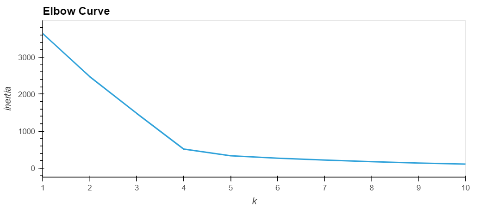
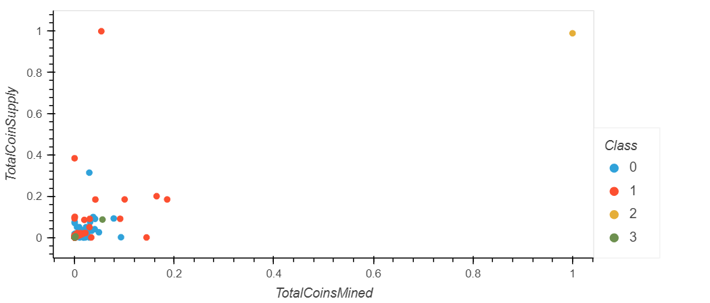
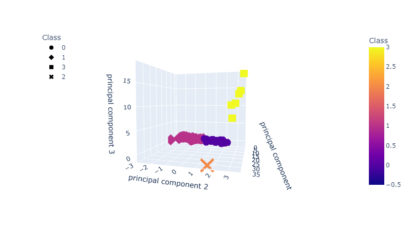

# Cryptocurrencies :money_with_wings: :currency_exchange:
OSU Module 18 - Unsupervised Machine Learning

### Transformations
  * Take raw data and make it easier to understand.  Pre-process data into correct format with only numerical values.

### Clustering Algorithms
  * Group similar objects into clusters. For example, using a PCA model.

### Preparing Data
  - Data Selection - making good choices about which data will be used.
  - Data Processing - organizing the data by formatting, cleaning, and sampling it.
  - Data Transformation - transforming our data into a simpler format for storage and future use, such as a CSV, spreadsheet, or database file.

  

  

  

#### Tools
  * conda 4.12.0
  * Python 3.7.11
  * scikit-learn 0.24.2
  * plotly 5.6.0
  * pandas 1.3.4